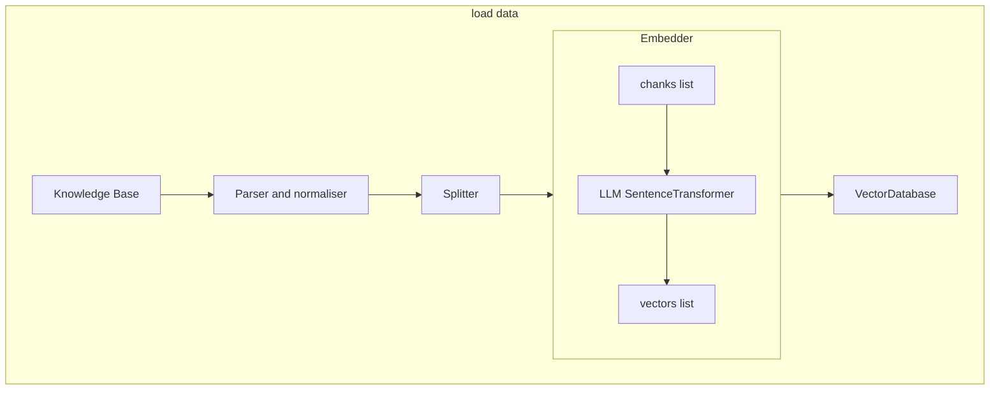

# rag_searchkit (commented)
A micro framework for **LLM semantic search**.

## Architecture



## Requirments
- Python 3.11/3.12
- Ubuntu 24.04
- GPU 4Gb VRAM - CUDA 5, ROCm 6

## Preparetion

### Get the sentence-transformers llm model
```bash
git lfs install
git clone https://huggingface.co/sentence-transformers/paraphrase-multilingual-MiniLM-L12-v2 st
```

### Prepare data source
- ePub book 
> Put ePub book to repo root, for example UpgradePC20.epub

### Prepare python environment
- For CPU
```bash
python3 -m venv .venv_llm
source ./.venv_llm/bin/activate
python -m pip install --upgrade pip
pip install -r requirements.txt
```
- For GPU AMD ROCm 6
```bash
python3 -m venv .venv_llm
source ./.venv_llm/bin/activate
python -m pip install --upgrade pip
pip install torch --index-url https://download.pytorch.org/whl/rocm6.0
pip install -r requirements.txt
```

## Dry run
- Load ePub to database
```bash
python app.py build --epub "Upgrading and Repairing PCs.epub"
```
- Run qery 
```bash
python app.py search --q "clear CMOS" --k 8 --format pretty
```
